# Deployment Execution Guide

Version: 1.0

Last updated: August 2026

## Purpose

This document describes how the Nieuwdam Cloud Platform deployment process is executed.

The guide documents the complete deployment lifecycle, starting from the initial Microsoft Entra ID tenant state through provisioning, validation and operational reporting.

The purpose is to demonstrate how the platform transforms a clean Microsoft Entra ID environment into a managed identity environment through controlled automation.

---

# Prerequisites

Before deploying the Nieuwdam Cloud Platform, the following components are required:

- Microsoft Azure tenant
- Microsoft Entra ID directory
- Administrative account with required permissions
- Microsoft Graph access
- PowerShell environment
- Required PowerShell modules
- Platform configuration files

The Nieuwdam Cloud Platform is designed to operate within an existing Microsoft Entra ID tenant.

Tenant creation is considered an external platform prerequisite and is therefore outside the scope of this automation framework.

---

# Execution Environment

The deployment process is executed from a local engineering workstation using:

- Visual Studio Code
- PowerShell
- Microsoft Graph PowerShell SDK
- Nieuwdam Cloud Platform repository

The deployment workstation communicates with Microsoft Entra ID through Microsoft Graph.

The documented deployment workflow does not require manual Azure Portal configuration during deployment execution. Identity provisioning, validation, state management and security configuration are performed through PowerShell automation and Microsoft Graph.

Example execution environment:

```text
Developer Workstation

        |

        v

PowerShell Automation

        |

        v

Microsoft Graph API

        |

        v

Microsoft Entra ID
```

---

# Repository Structure

The Nieuwdam Cloud Platform is organized into separate PowerShell modules, with each module responsible for a specific area of the deployment lifecycle.

The repository uses the following module structure:

```text
modules
├── Configuration
│   └── Configuration.psm1
├── Graph
│   └── Graph.psm1
├── Helpers
│   └── Helpers.psm1
├── Logging
│   └── Logging.psm1
├── Provisioning
│   └── Provisioning.psm1
├── Reporting
│   ├── Templates
│   │   ├── validation.css
│   │   ├── validation.js
│   │   └── validation-report.html
│   └── Reporting.psm1
├── Security
│   ├── ConditionalAccess
│   │   ├── CA001-BlockLegacyAuthentication.ps1
│   │   ├── CA002-RequireMFAAdmins.ps1
│   │   ├── CA003-RequireMFAUsers.ps1
│   │   ├── CA004-RequireMFAExternal.ps1
│   │   ├── CA005-RequireCompliantDevice.ps1
│   │   ├── CA006-BlockRiskySignin.ps1
│   │   ├── CA007-ProtectBreakGlass.ps1
│   │   └── CA008-SessionControl.ps1
│   └── Security.psm1
└── Validation
    └── Validation.psm1
```

Each module has a dedicated responsibility:

* **Configuration** — Loads and validates platform, tenant, provisioning, cleanup and security configuration.
* **Graph** — Establishes Microsoft Graph connectivity, handles authentication and provides tenant and directory context.
* **Helpers** — Provides shared utility functions used by other components.
* **Logging** — Provides centralized operational logging and message handling.
* **Provisioning** — Creates and manages users, groups and group memberships.
* **Reporting** — Generates validation reports and provides reporting templates.
* **Security** — Evaluates and configures Microsoft Entra ID security controls, including authentication methods, MFA, Conditional Access, Security Defaults and break-glass account validation.
* **Validation** — Verifies the resulting Microsoft Entra ID environment against the expected configuration.

The Conditional Access components are maintained as separate scripts under the Security module so that individual policy implementations remain independently maintainable and testable.

The deployment scripts orchestrate these modules to provide a controlled end-to-end deployment workflow.


---

## Deployment Entry Point

The primary execution entry point for the Nieuwdam Cloud Platform is:

```powershell
.\scripts\deploy-environment.ps1
```

The deployment orchestrator controls the complete deployment sequence and invokes the individual provisioning, validation, state management and security scripts in the required order.

The individual scripts are implemented as reusable deployment components and can also be executed independently for development, testing and troubleshooting purposes.

The documented standard deployment flow uses the deployment orchestrator rather than executing the individual scripts manually.

---

# Security Considerations

Screenshots used in this documentation are reviewed before publication.

Sensitive information is removed or hidden, including:

- Tenant identifiers
- Administrative account information
- Authentication details
- Access tokens
- Internal identifiers and object IDs

The displayed users, groups and memberships are part of a fictional demonstration environment and are included to illustrate the platform provisioning workflow.

The documentation demonstrates the complete deployment lifecycle without exposing sensitive production environment information.

---

# Initial Environment State

Before deployment execution, the Microsoft Entra ID tenant contains only the administrative identity required to operate the platform.

This initial state represents the starting point before automated identity provisioning begins.

The purpose of documenting the initial state is to demonstrate the lifecycle transition from a clean Microsoft Entra ID tenant baseline into a managed identity environment.

---

## Microsoft Entra ID Tenant Overview

The initial tenant configuration contains:

- Dedicated Microsoft Entra ID tenant
- Administrative identity
- No managed users
- No security groups
- No application resources created by the platform

The tenant overview provides the baseline environment before automation execution.

The following screenshot demonstrates the initial Microsoft Entra ID tenant baseline before deployment execution.

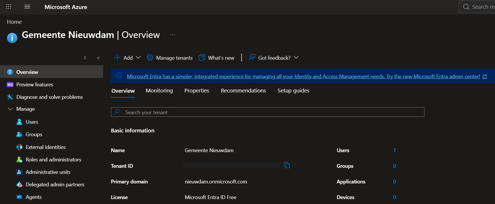

---

## Initial User State

Before deployment, the tenant contains only the administrative account required for platform management and deployment execution.

This account is responsible for:

- Executing deployment workflows
- Performing administrative operations
- Managing Microsoft Graph communication

No end-user identities are created manually.

New identity objects are provisioned through the automation framework. Existing objects are detected and handled according to the configured deployment logic.

The following screenshot demonstrates the initial Microsoft Entra ID user state before automated provisioning.

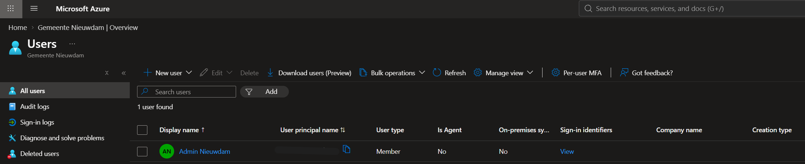

---

# Deployment Workflow

The deployment process follows a controlled execution lifecycle.

```text
Initial Tenant State
        ↓
Load Platform Configuration
        ↓
Connect to Microsoft Graph
        ↓
Provision Users
        ↓
Provision Groups
        ↓
Configure Group Memberships
        ↓
Validate Environment
        ↓
Save Provision State
        ↓
Configure Security Baseline
        ↓
Deployment Complete
```

Each component performs a dedicated responsibility while the deployment orchestrator controls the execution sequence.

## Deployment Orchestration

The recommended deployment method is to execute `deploy-environment.ps1`, which acts as the main deployment orchestrator.

The orchestrator controls the execution order of the individual provisioning components and maintains a consistent deployment context throughout the complete workflow.

A single RunId is generated at the start of the deployment and passed to the individual provisioning scripts. The Microsoft Graph connection is also established by the orchestrator and reused by the provisioning components where supported.

The standard execution sequence is:

```text
deploy-environment.ps1
│
├── 01-provision-users.ps1
├── 02-provision-groups.ps1
├── 03-provision-group-memberships.ps1
├── 04-validate-environment.ps1
├── 05-save-provision-state.ps1
└── 07-configure-security.ps1
```

This separation allows each provisioning component to remain independently testable while the deployment orchestrator provides a controlled end-to-end execution path.

The individual provisioning scripts can also be executed independently for component-level testing and troubleshooting. The standard deployment workflow, however, is executed through deploy-environment.ps1.

---

# Microsoft Graph Authentication

Before deployment execution, the platform establishes a connection with Microsoft Graph.

Authentication is performed through Microsoft Graph PowerShell using interactive delegated authentication with an administrative account.

The platform does not store credentials, passwords or secrets inside the repository.

Authentication flow:

```text
PowerShell

        |

        v

Microsoft Graph PowerShell SDK

        |

        v

Microsoft Entra Authentication

        |

        v

Microsoft Graph API
```

A successful authentication allows the automation framework to perform identity operations according to the assigned permissions.

The following screenshot demonstrates successful Microsoft Graph connection validation and tenant context availability.

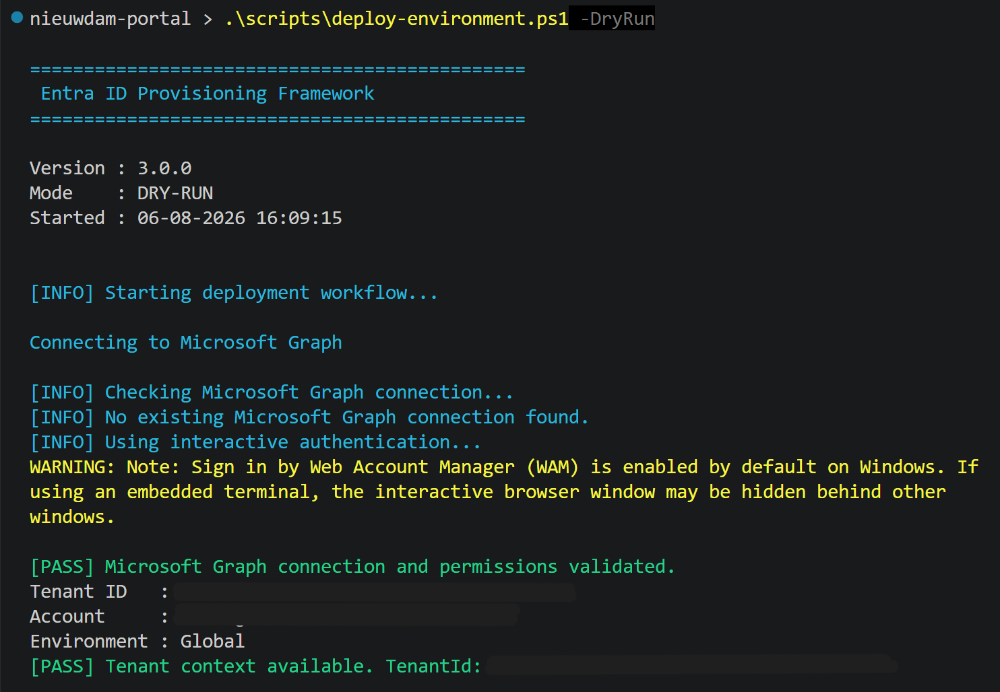

---

# Dry Run Execution

Before applying changes to Microsoft Entra ID, the deployment can be executed in Dry Run mode.

Dry Run evaluates the expected deployment actions without modifying the environment.

During Dry Run execution:

- Configuration is loaded
- Existing resources are evaluated
- Planned actions are calculated
- No Microsoft Entra ID changes are performed
- Results are generated for review
- Security baseline configuration is simulated

Dry Run provides a safe validation step before executing production changes.

Example execution:

```powershell
.\scripts\deploy-environment.ps1 -DryRun
```

Expected behaviour:

```text
Configuration loaded

Current environment evaluated

Planned actions generated

No changes applied
```

---

# Dry Run Result

The Dry Run output demonstrates which resources would be created or modified.

Example actions:

- WouldCreate users
- WouldCreate groups
- WouldAdd memberships
- Skipped existing resources
- Failed operations

The following screenshots demonstrate the individual provisioning stages executed during the Dry Run process. The framework evaluates the configured resources and calculates the expected changes without modifying the Microsoft Entra ID environment.

---

## User Provisioning Dry Run

The following screenshots demonstrate the Dry Run execution of user provisioning. The framework loads the configured user definitions and calculates the planned user creation actions.

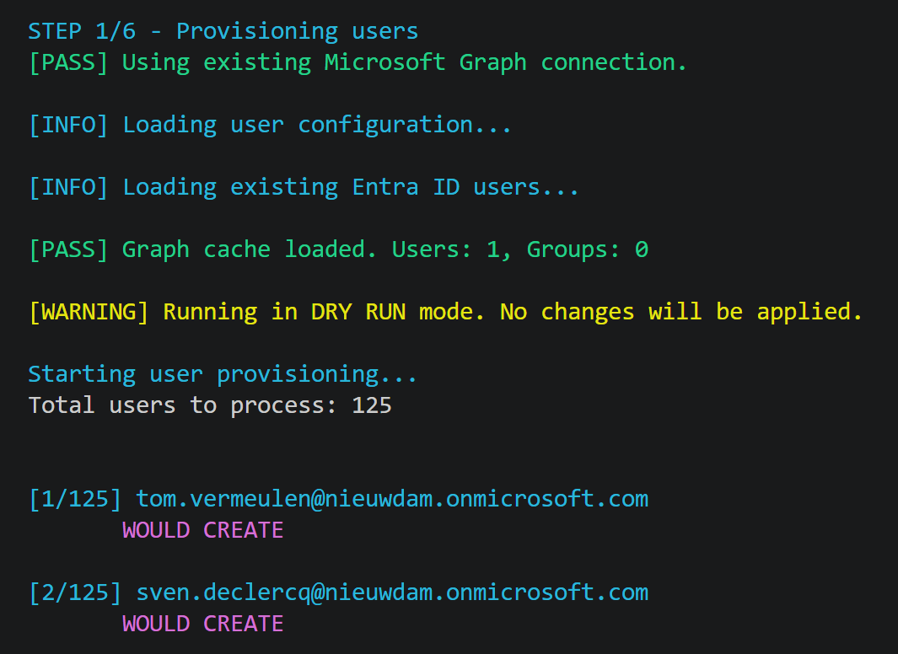

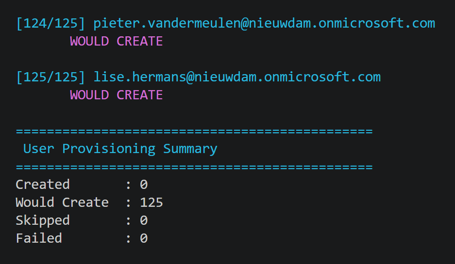

---

## Group Provisioning Dry Run

The following screenshots demonstrate the Dry Run execution of group provisioning. The framework evaluates the configured security groups and calculates the planned group creation actions.

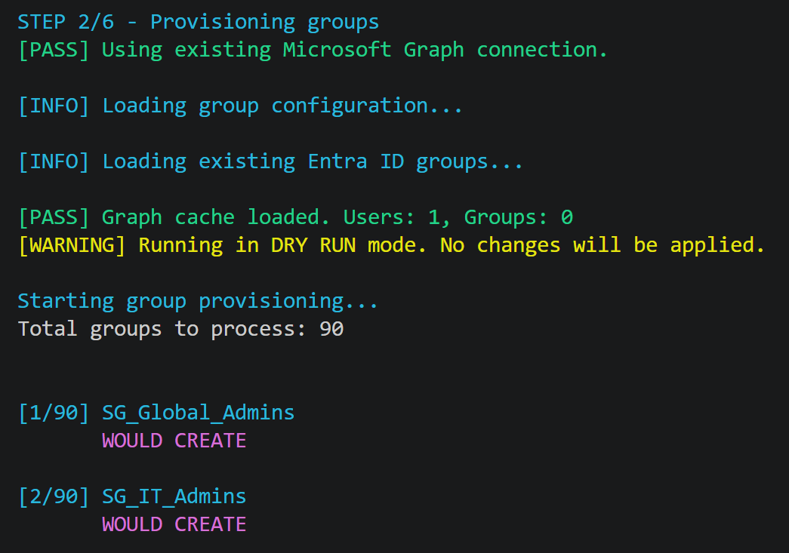

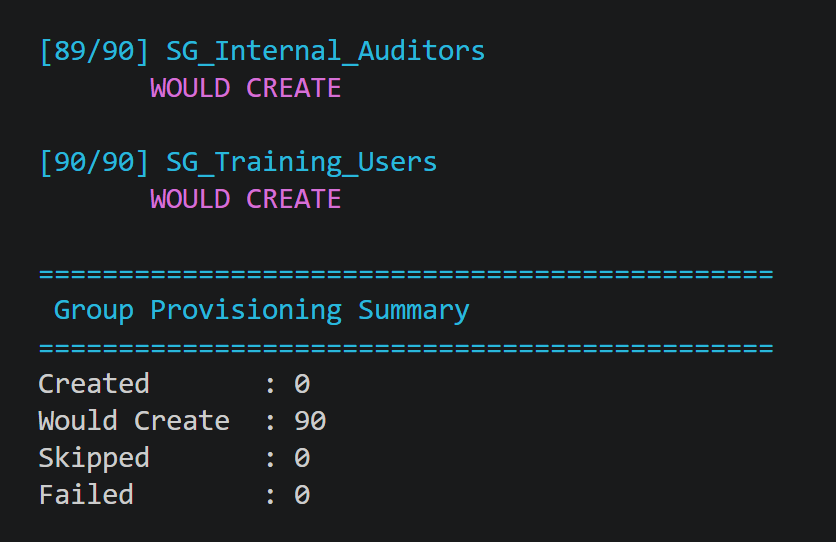

---

## Group Membership Provisioning Dry Run

The following screenshots demonstrate the Dry Run execution of group membership provisioning. The framework evaluates the configured membership assignments and calculates the planned membership changes.

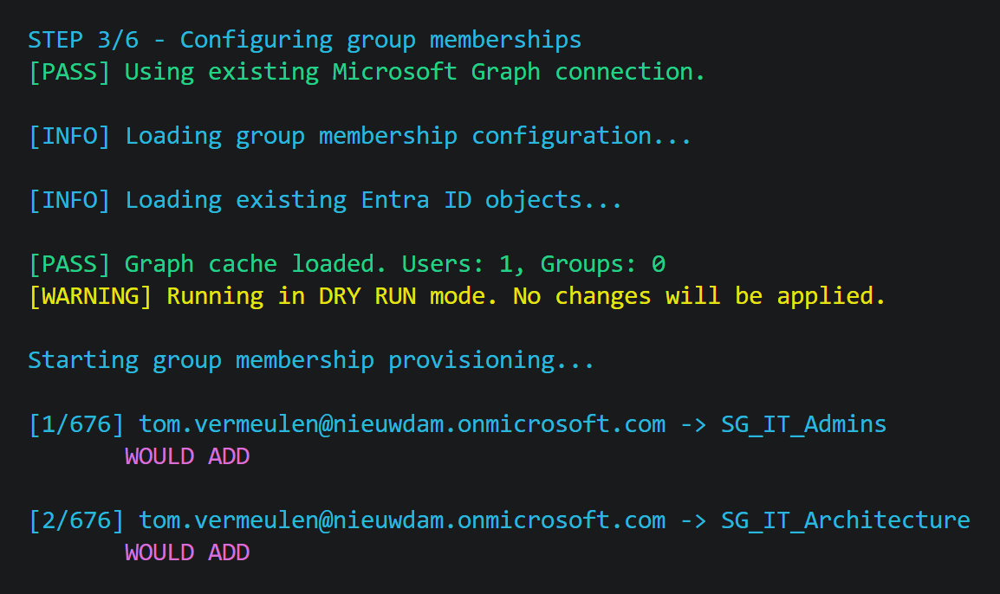

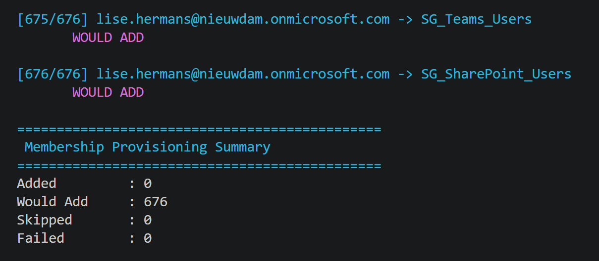

---

## Deployment Completion

The following screenshot demonstrates the successful completion of the Dry Run workflow.

During Dry Run execution, provisioning actions are evaluated without applying changes to Microsoft Entra ID. The validation stage is intentionally skipped because no live deployment changes have been applied, and provision state persistence is also skipped.

The security baseline is executed in Dry Run mode so that planned security operations can be evaluated without modifying the tenant.

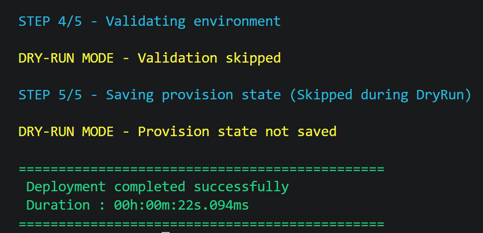

---

# Deployment Execution

After reviewing the Dry Run results, the deployment can be executed.

The deployment process performs:

* User provisioning
* Group provisioning
* Group membership assignment
* Environment validation
* Provision state storage
* Security baseline configuration

All operations are executed through reusable PowerShell modules and Microsoft Graph integration.

The provisioning workflow is designed to be idempotent. Existing users, groups and memberships are detected and are not unnecessarily recreated.

Standard deployment execution:

```powershell
.\scripts\deploy-environment.ps1
```

Before applying changes, the deployment requires explicit operator confirmation. The operator must type `DEPLOY` before the live deployment can continue.

The following screenshot demonstrates the deployment confirmation step before changes are applied to Microsoft Entra ID.

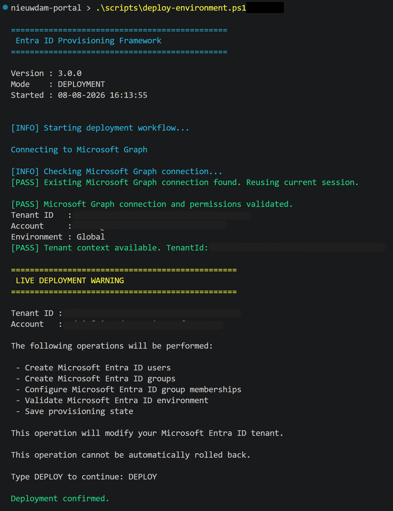

---

## Live User Provisioning

After deployment confirmation, the provisioning workflow creates the configured Microsoft Entra ID user accounts through Microsoft Graph.

The user provisioning stage validates the configured user definitions, checks for existing accounts and creates missing users.

The following screenshot demonstrates the start of the live user provisioning stage.

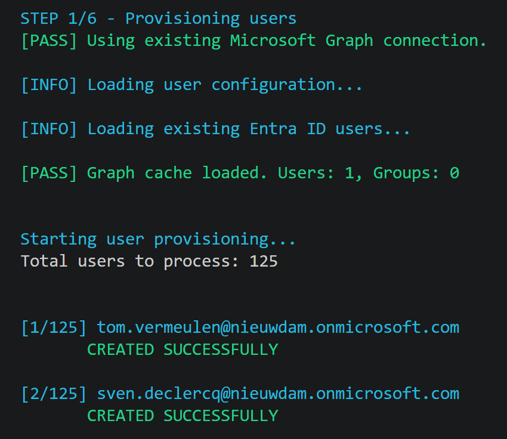

The following screenshot demonstrates the completed user provisioning stage and the resulting provisioning actions.

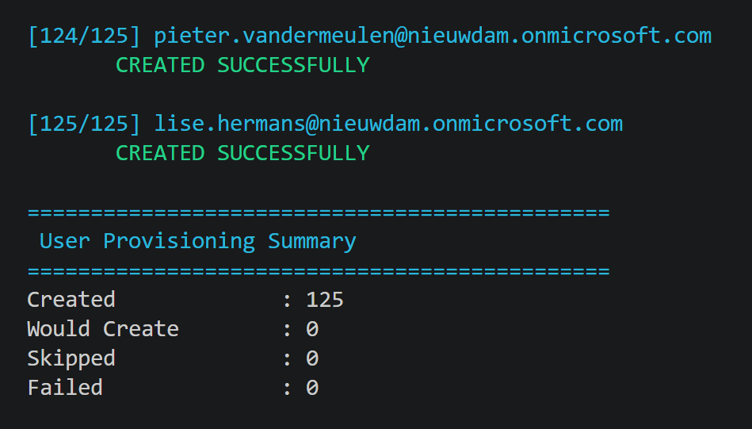

---

## Live Group Provisioning

After user provisioning, the deployment creates the configured Microsoft Entra ID security groups.

Existing groups are detected before creation to prevent unnecessary duplication.

The following screenshot demonstrates the start of the live group provisioning stage.

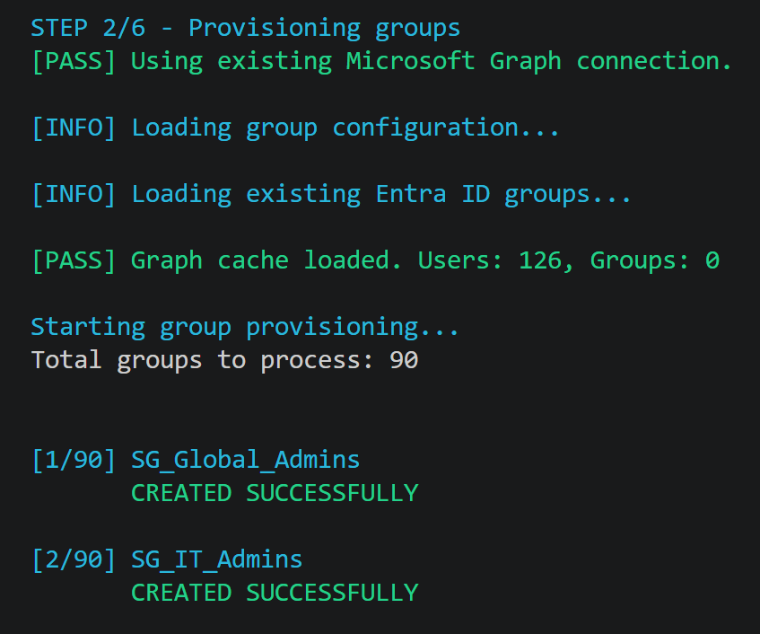

The following screenshot demonstrates the completed group provisioning stage.

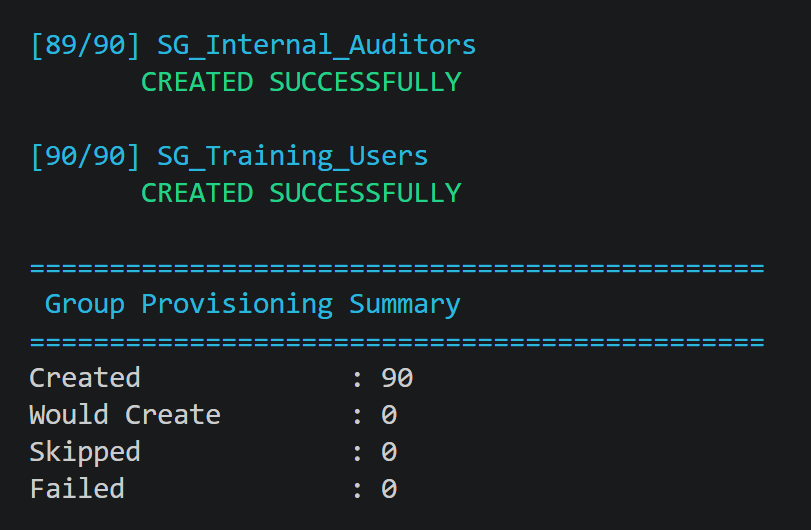

---

## Live Group Membership Provisioning

After users and groups have been provisioned, the deployment configures the membership relationships defined in the platform configuration.

The membership provisioning component resolves the required users and groups and adds missing memberships through Microsoft Graph.

The following screenshot demonstrates the start of the live group membership provisioning stage.

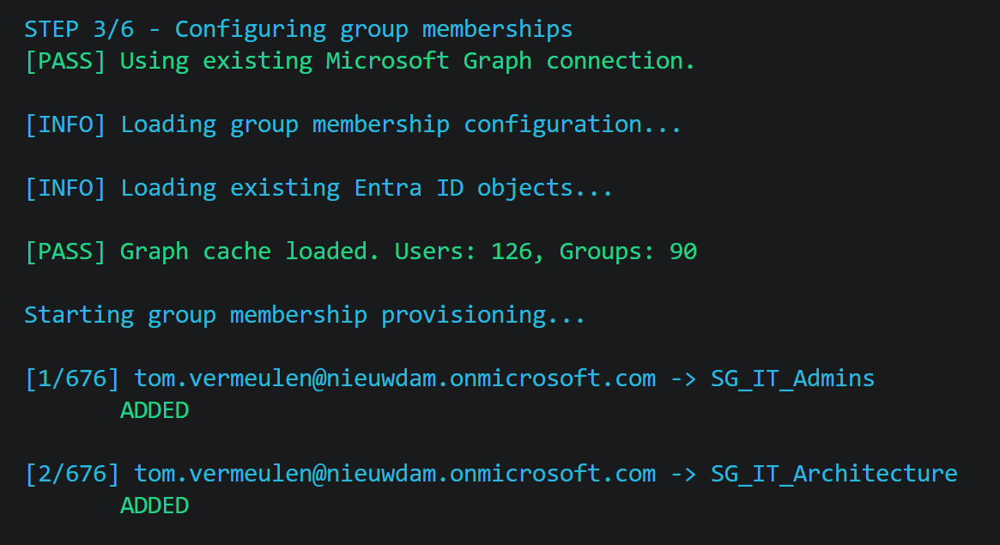

The following screenshot demonstrates the completed group membership provisioning stage.

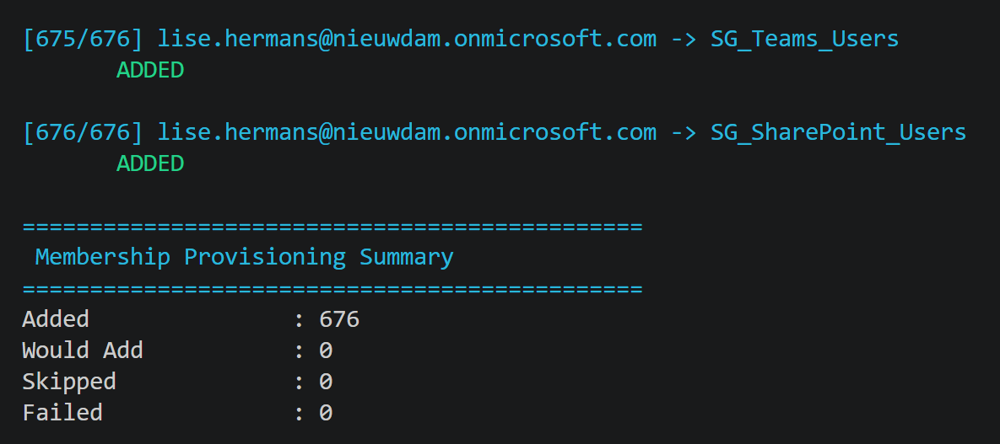

---

# Validation

After identity provisioning has completed, the environment is validated against the expected configuration.

Validation verifies:

* Users exist
* Groups exist
* Membership relationships exist
* Configured resources match the expected state

The validation process uses read-only Microsoft Entra ID operations and does not modify directory resources. Validation results are then written to generated CSV and HTML reports.

The following screenshot demonstrates the live validation stage executed after provisioning.

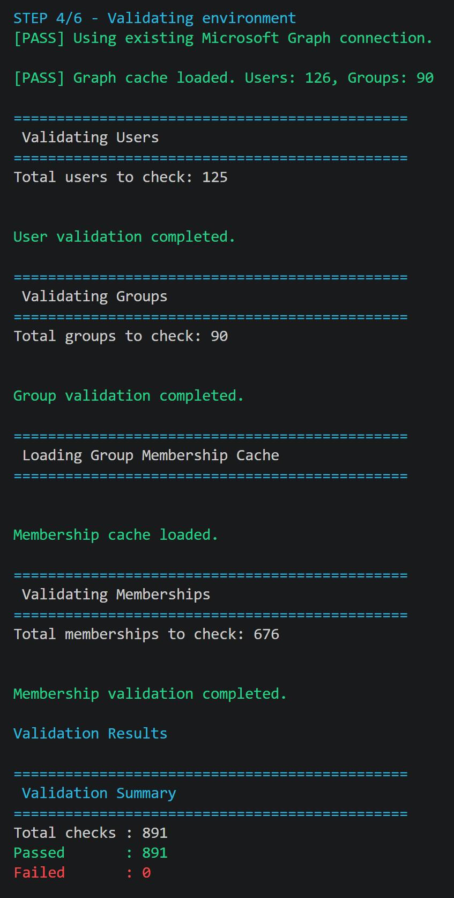

---

# Reporting and State Management

After successful environment validation, the deployment generates structured validation artifacts and executes the dedicated provision state management step.

During a standard deployment, `05-save-provision-state.ps1` creates the provision state file using the resources managed during the deployment.

Each deployment execution receives a unique RunId which provides traceability across provisioning operations, validation results, generated reports and stored state.

The provision state contains the managed users, groups and memberships identified from the current Microsoft Entra ID environment and provides a controlled basis for resource tracking and future deprovisioning.

Provision state is not created during Dry Run execution because no resources are actually provisioned.

The following screenshot demonstrates the successful provision state persistence stage.

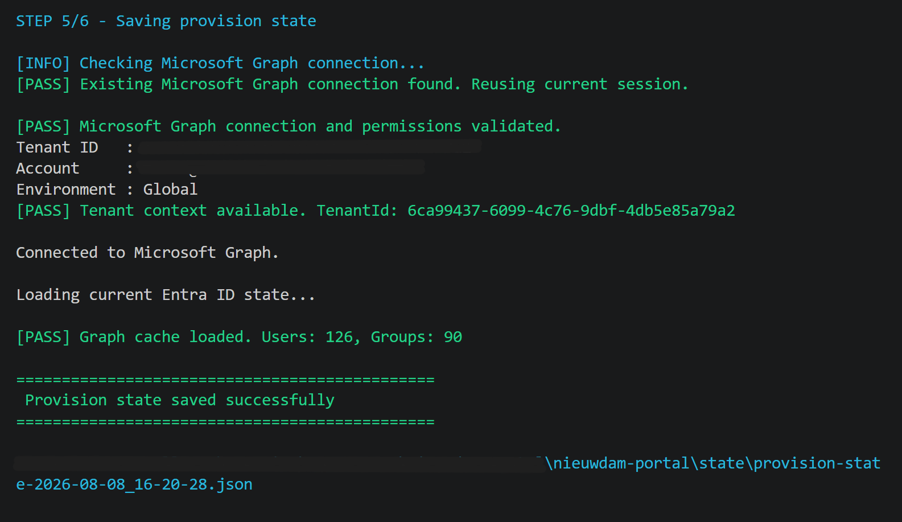

Generated reports include:

* HTML
* CSV
* JSON

Example generated artifacts:

```text
logs/

deployment.log

users.log

groups.log

memberships.log

validate.log


reports/

validation-<timestamp>.json

validation-<timestamp>.csv

validation-<timestamp>.html


state/

provision-state-<timestamp>.json
```

---

# Security Baseline Configuration

The Nieuwdam Cloud Platform contains a dedicated security configuration component for Microsoft Entra ID.

The security baseline stage evaluates and configures Microsoft Entra ID security controls according to the platform security configuration.

* Password policy
* Authentication methods
* MFA configuration
* Conditional Access policies
* Security Defaults validation
* Break-glass account validation
* Security configuration reporting

Security operations support Dry Run execution so that planned changes can be reviewed before they are applied.

The security configuration component generates a security report containing the results of the executed security operations.

The following screenshot demonstrates the live security baseline configuration stage.

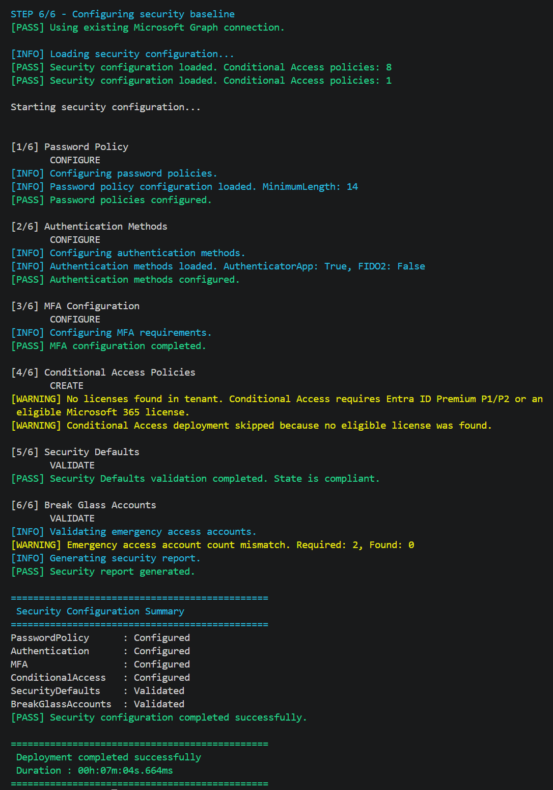

The security configuration component is designed as an independent component of the deployment architecture and can be extended with additional security controls as the platform evolves.

---

# Deployment Result

A successful deployment produces structured operational results containing information such as:

* RunId
* Timestamp
* Object type
* Object name
* Action performed
* Execution status
* Operational message
* Created objects
* Skipped objects
* Failed operations

Example:

```text
Object Type:
User

Object Name:
john.doe@nieuwdam.onmicrosoft.com

Action:
Created

Status:
Success
```

The detailed provisioning output is captured during each individual deployment stage. The final environment verification provides a consolidated view of the resulting tenant state.

---

# Validation Report

Validation results are generated through the Reporting component.

The validation report provides:

* Validation status
* Processed objects
* Expected state
* Actual state
* Operational messages

The generated validation results are stored in structured formats for further processing.

The generated JSON and CSV validation reports provide machine-readable evidence of the validation results.

---

# Validation Dashboard

The Nieuwdam Cloud Platform generates an interactive HTML validation dashboard based on the generated validation results.

The dashboard provides an operational view of the Microsoft Entra ID validation state.

The dashboard includes:

* Validation summary statistics
* Total validation checks
* Passed and failed checks
* Success percentage
* Validation progress indicator
* Search functionality
* Status filtering
* Detailed validation result table
* Pagination support

The dashboard loads the generated validation JSON output and provides a user-friendly interface for reviewing validation results.

The following screenshot demonstrates the interactive validation dashboard.

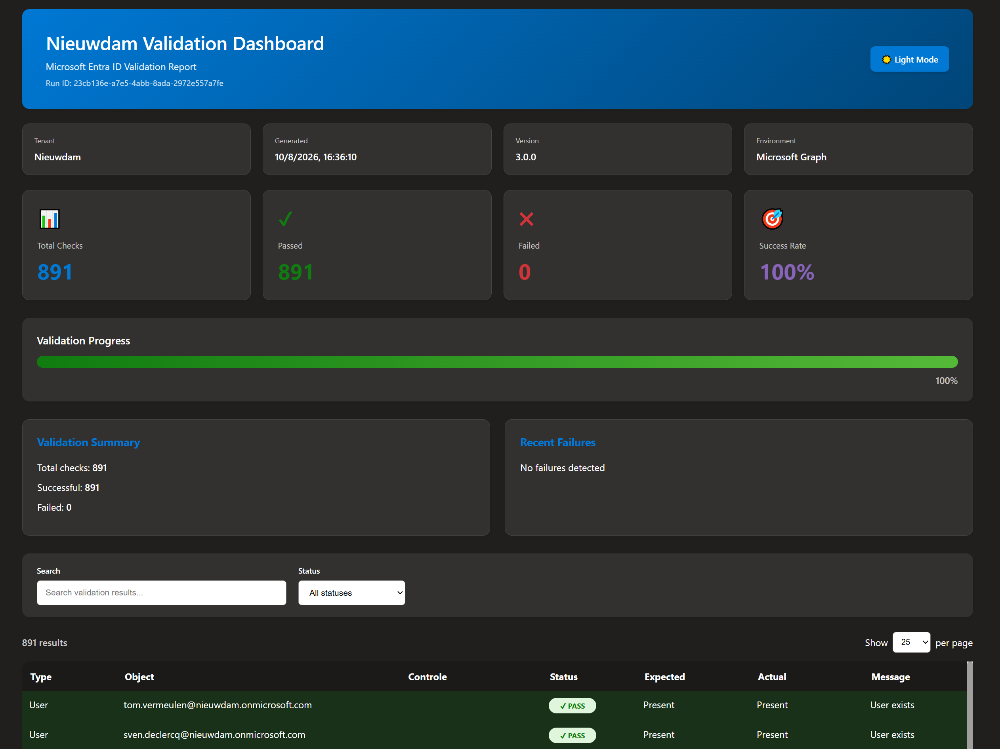

---

# Final Environment State

After successful deployment, the Microsoft Entra ID environment contains the resources defined within the platform configuration.

The final state demonstrates:

- Automated identity provisioning
- Group provisioning
- Membership assignment
- Validation execution
- Deployment state tracking

A final Microsoft Graph verification is performed to confirm the resulting tenant state.

## Final Users

The final Microsoft Entra ID user view provides a visual confirmation that the configured user identities have been provisioned successfully.

The following screenshot demonstrates the users present in the final environment.

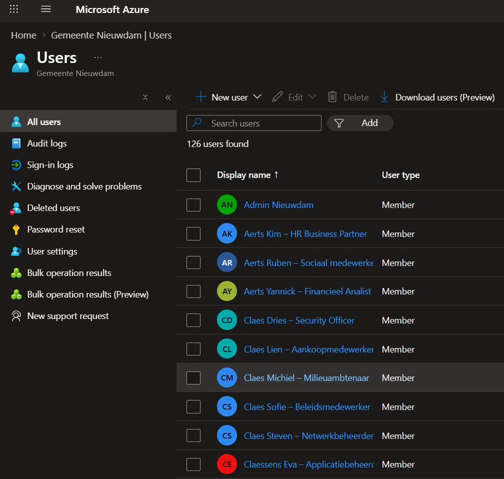

## Final Security Groups

The final Microsoft Entra ID group view provides a visual confirmation that the configured security groups have been provisioned successfully.

The following screenshot demonstrates the security groups present in the final environment.

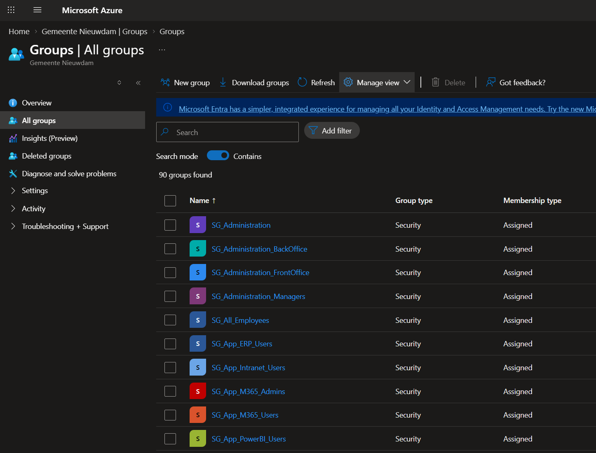

## Final Group Memberships

The final membership view provides a visual confirmation that users have been assigned to the appropriate security groups.

The following screenshot demonstrates the resulting group membership relationships.

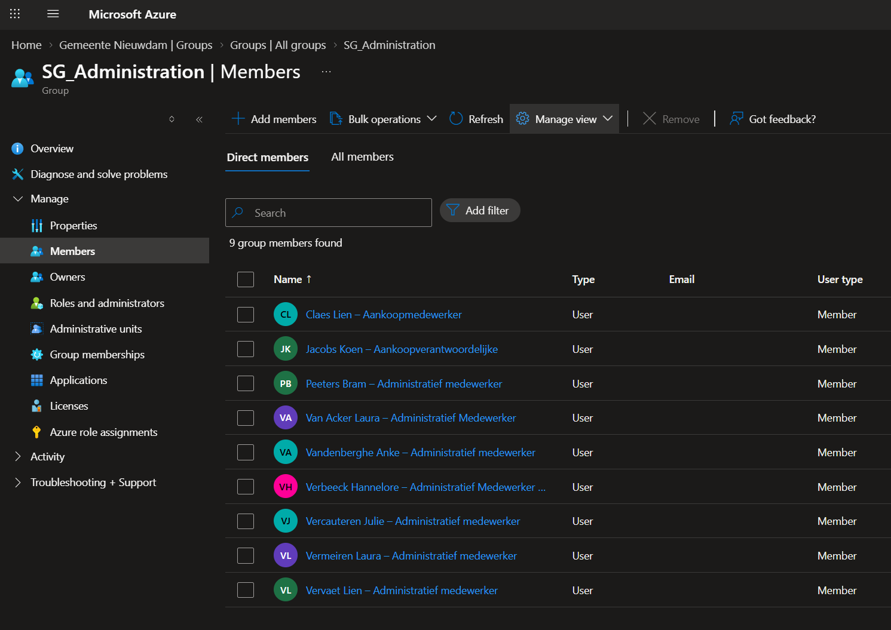

## Final Environment Verification

The final verification provides a consolidated view of the resulting tenant state.

The verification confirms:

```text
Users        : 126
Groups       : 90
Memberships  : 676
```

The combination of Microsoft Graph verification and the final Microsoft Entra ID screenshots provides both machine-readable and visual evidence of the completed deployment.

---

# Deployment Artifacts

During execution, the platform generates operational artifacts for auditing and troubleshooting.

These artifacts provide:

* Execution traceability through log files
* Validation evidence through generated reports
* Deployment history through timestamped provision state files

Generated artifacts:

```text
logs/

deployment.log

users.log

groups.log

memberships.log

validate.log


reports/

validation-<timestamp>.json

validation-<timestamp>.csv

validation-<timestamp>.html


state/

provision-state-<timestamp>.json
```

---

# Deprovisioning and Environment Cleanup

The Nieuwdam Cloud Platform also provides a controlled deprovisioning workflow for removing Microsoft Entra ID resources previously provisioned by the platform.

Deprovisioning is intentionally separated from the standard deployment workflow. It is not executed as part of a normal deployment and must be initiated explicitly by an operator.

The deprovisioning process is implemented by:

```powershell
.\scripts\06-deprovision-environment.ps1
```

The script uses the previously generated provision state file to determine which users, groups and group memberships are managed by the platform.

This prevents the cleanup process from relying solely on the current configuration and provides a controlled basis for removing resources that were previously provisioned.

## Deprovisioning Lifecycle

The deprovisioning workflow follows a controlled removal sequence:

```text
Provision State
        ↓
Validate Managed Objects
        ↓
Load Current Entra ID State
        ↓
Remove Group Memberships
        ↓
Remove Groups
        ↓
Remove Users
        ↓
Generate Execution Summary
        ↓
Cleanup Complete
```

Memberships are removed before groups, and groups are removed before users. This ordering ensures that group membership relationships are cleaned up before the corresponding directory objects are deleted.

## Provision State

The deprovisioning process uses the provision state generated by:

```powershell
.\scripts\05-save-provision-state.ps1
```

The state file contains the resources managed by the provisioning framework, including:

* Provisioned users
* Provisioned groups
* Group memberships
* Object identifiers
* Tenant information
* Framework version
* Deployment RunId

The following screenshot demonstrates the provision state used as the source of truth for the deprovisioning process. The state records the deployment RunId, tenant context, deployment status and the managed resource counts.

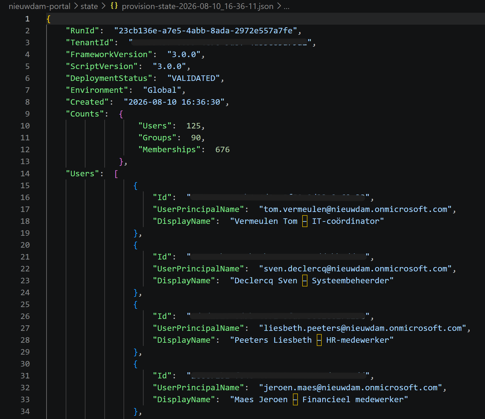

The deprovisioning script automatically selects the most recently created provision state file when no specific state file is supplied.

A specific state file can also be supplied explicitly:

```powershell
.\scripts\06-deprovision-environment.ps1 `
    -StateFile ".\state\provision-state-<timestamp>.json"
```

Using the provision state provides an additional safety boundary because the deprovisioning process targets resources recorded as managed by the framework rather than attempting to remove arbitrary tenant resources.

### Dry Run Deprovisioning

Before performing a live cleanup, the deprovisioning workflow can be executed in Dry Run mode.

Dry Run evaluates the resources that would be removed without making changes to Microsoft Entra ID.

Example:

```powershell
.\scripts\06-deprovision-environment.ps1 -DryRun
```

The Dry Run output identifies:

* Memberships that would be removed
* Groups that would be removed
* Users that would be removed
* Objects that are already absent
* Protected users that would be skipped
* Potential failures

No directory objects are removed during Dry Run execution.

The following screenshots demonstrate the deprovisioning Dry Run from start to completion, including the selected provision state, RunId, Dry Run mode and the processing of managed memberships, groups and users.

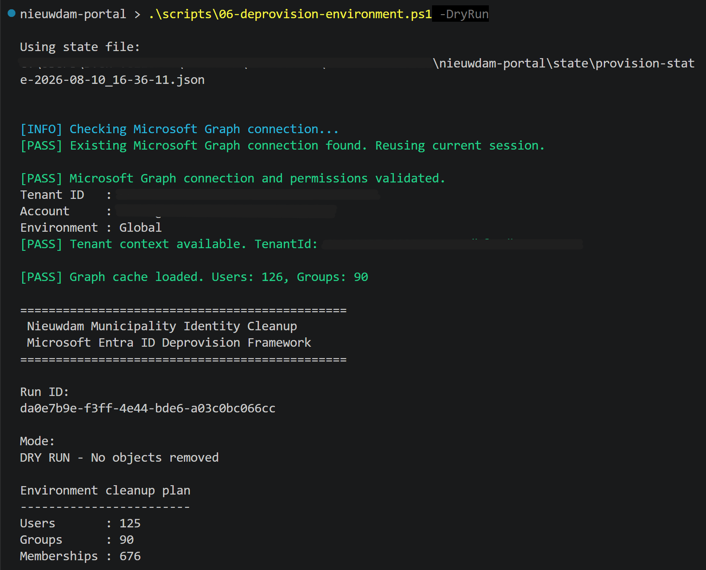

### Membership Cleanup

The membership cleanup stage processes all 676 recorded group memberships. The first screenshot demonstrates the start of the membership processing, while the second demonstrates completion of the full membership set.

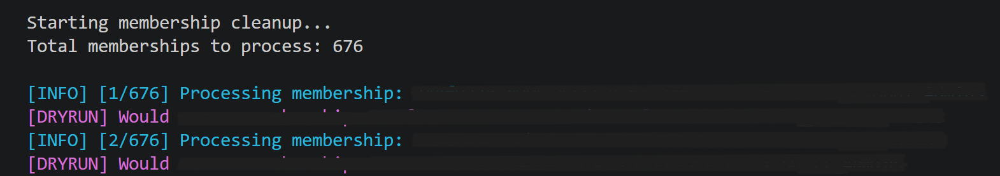
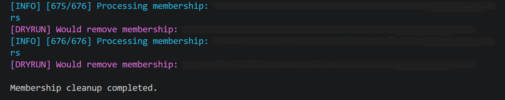

### Group Cleanup

After membership processing, the Dry Run evaluates the 90 managed security groups. The screenshots demonstrate the beginning and completion of the group cleanup stage.

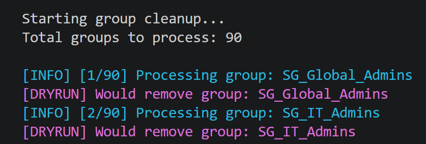
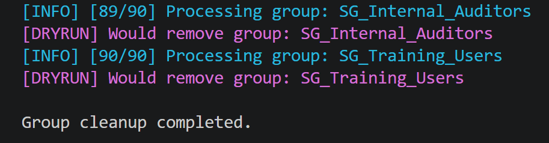

### User Cleanup

The final resource stage evaluates the 125 managed user accounts. The screenshots demonstrate the beginning and completion of the user cleanup stage.

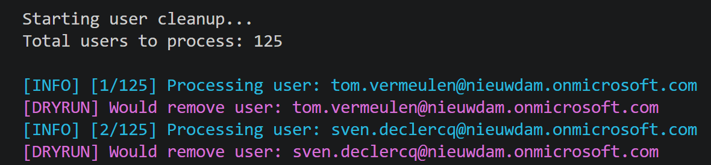
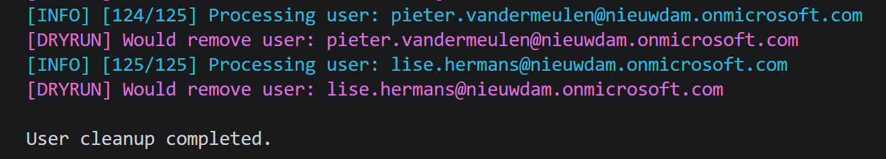

### Dry Run Summary

The final Dry Run summary confirms that all managed resources were evaluated for removal without modifying Microsoft Entra ID. The planned counts correspond to the resources recorded in the provision state.

The following screenshot demonstrates the final Dry Run execution summary, confirming that 676 memberships, 90 groups and 125 users were planned for removal, while no resources were actually removed.

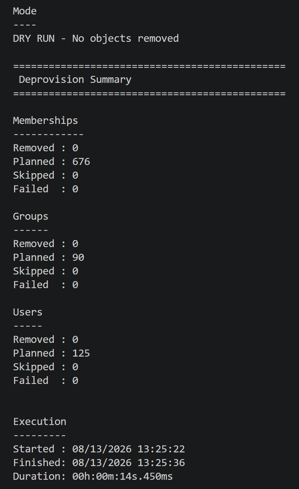

## Live Deprovisioning

Live deletion is explicitly enabled through the `-ConfirmDelete` parameter. The parameter acts as a safety gate for destructive operations. Without `-ConfirmDelete`, the script exits before any directory objects are removed.

Unlike the deployment workflow, deprovisioning does not require an interactive `DEPLOY` confirmation prompt.

The cleanup is therefore not performed simply by executing the script without arguments.

Example:

```powershell
.\scripts\06-deprovision-environment.ps1 -ConfirmDelete
```

The script connects to Microsoft Graph, loads the selected provision state and processes the recorded resources.

The cleanup order is:

```text
Group Memberships
        ↓
Groups
        ↓
Users
```

Objects that no longer exist are skipped rather than treated as successful deletion operations.

The following screenshot demonstrates the start of the live deprovisioning execution, including the selected provision state, RunId and deletion mode.

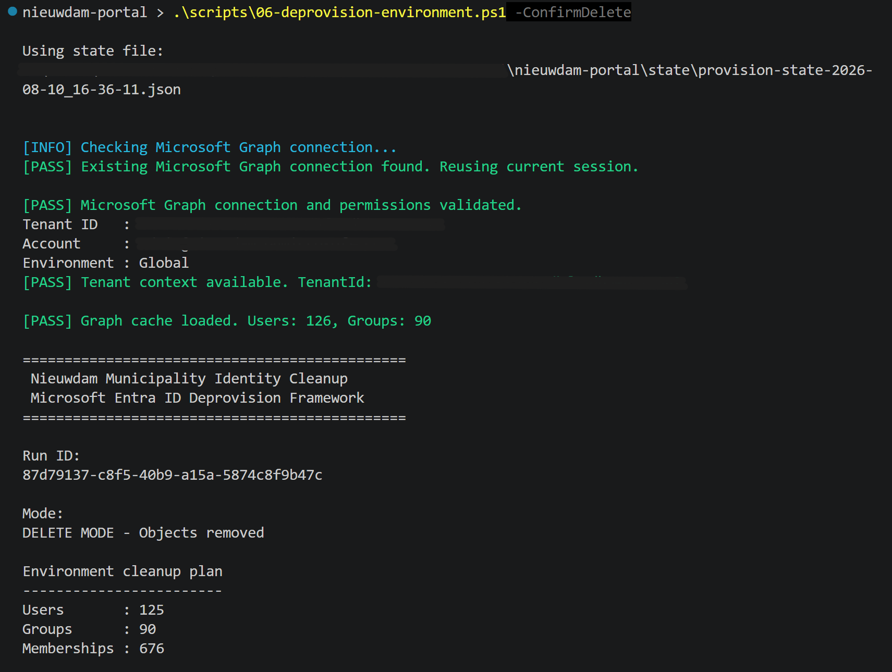

### Live Membership Cleanup

The first stage of the live cleanup removes the group membership relationships recorded in the provision state.

The membership cleanup processes all managed group memberships before any groups are removed. This ensures that membership relationships are cleaned up before the corresponding groups are deleted.

The following screenshot demonstrates the start of the live membership cleanup stage.

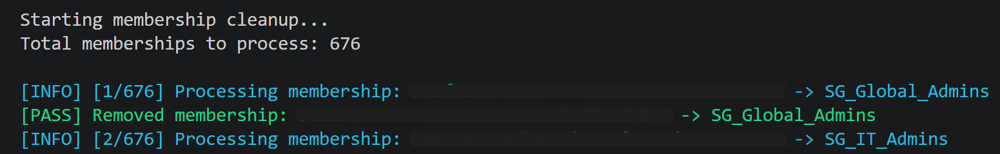

The following screenshot demonstrates the completion of the live membership cleanup stage.

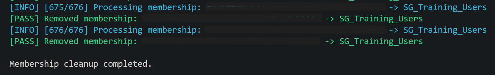

### Live Group Cleanup

After the membership relationships have been processed, the deprovisioning workflow removes the managed security groups recorded in the provision state.

The following screenshot demonstrates the start of the live group cleanup stage.

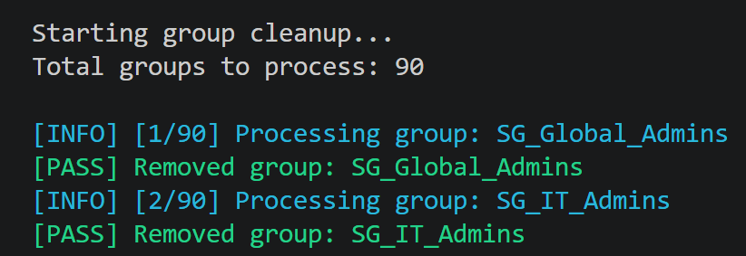

The following screenshot demonstrates the completion of the live group cleanup stage.

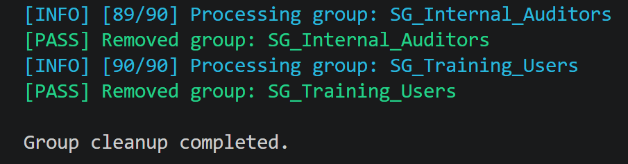

### Live User Cleanup

After group cleanup has completed, the deprovisioning workflow processes the managed user accounts.

Protected administrative accounts are excluded from deletion according to the configured protected-user list.

The following screenshot demonstrates the start of the live user cleanup stage.

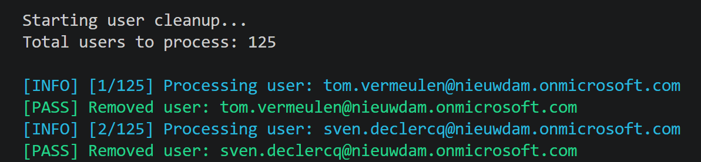

The following screenshot demonstrates the completion of the live user cleanup stage.

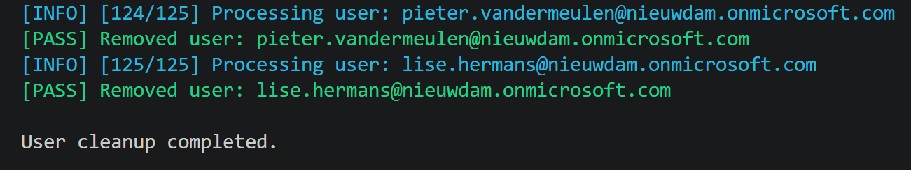

### Live Deprovisioning Summary

After all cleanup stages have completed, the script generates a final deprovisioning summary.

The summary reports the number of memberships, groups and users that were removed, skipped or failed during the live cleanup operation.

The following screenshot demonstrates the final live deprovisioning summary.

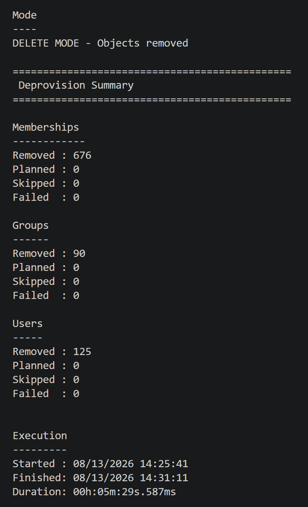

## Protected Accounts

The deprovisioning process contains an explicit protected-user exclusion mechanism.

Protected administrative identities are not removed by the cleanup workflow even when they are encountered during processing.

This provides an additional safeguard against accidentally deleting administrative accounts required to operate the tenant.

The protected account configuration should be reviewed and maintained as part of the platform's operational security controls.

## Idempotent Cleanup

The deprovisioning process is designed to be repeatable.

If a membership, group or user has already been removed, the resource is detected as absent and skipped.

This allows an interrupted or partially completed cleanup operation to be safely resumed without requiring the entire process to start again.

## Deprovisioning Summary

After execution, the script produces a structured cleanup summary containing information such as:

* RunId
* Memberships removed
* Memberships planned
* Memberships skipped
* Memberships failed
* Groups removed
* Groups planned
* Groups skipped
* Groups failed
* Users removed
* Users planned
* Users skipped
* Users failed

The execution is also recorded through the platform logging framework.

## Relationship to Deployment

Deprovisioning is deliberately excluded from the standard deployment sequence.

The complete platform lifecycle can therefore be represented as two separate operational workflows:

### Deployment

```text
Configuration
      ↓
Provision
      ↓
Validate
      ↓
Save State
      ↓
Secure
      ↓
Operational State
```

### Deprovisioning

```text
Provision State
      ↓
Validate Managed Resources
      ↓
Remove Memberships
      ↓
Remove Groups
      ↓
Remove Users
      ↓
Cleanup Complete
```

This separation ensures that a normal deployment cannot accidentally trigger destructive cleanup operations.

The deprovisioning workflow should only be executed intentionally as part of environment teardown, controlled cleanup, testing or another approved operational procedure.


---

# Operational Summary

The deployment lifecycle demonstrates the complete identity automation process:

```text
Prepare
    ↓
Deploy
    ↓
Provision
    ↓
Validate
    ↓
Save State
    ↓
Secure
    ↓
Operate
    ↓
Deprovision
```

The Nieuwdam Cloud Platform uses this structured deployment approach to provide repeatable, auditable and maintainable Microsoft Entra ID automation.
